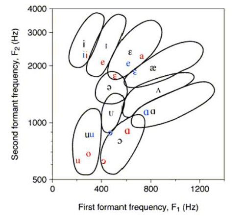
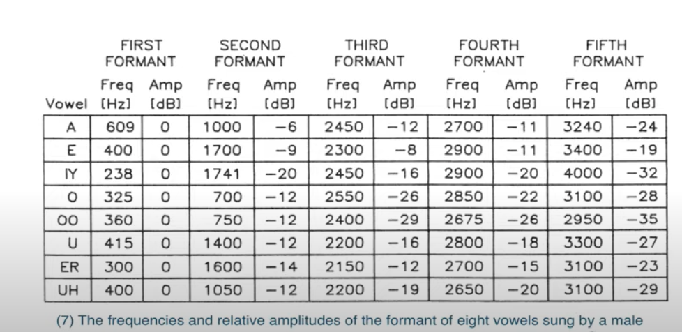
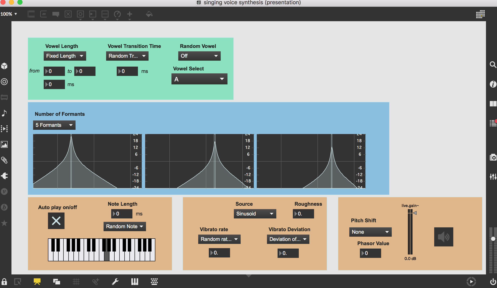

# INTRODUCTION

Human voice is a complex signal since it is made of many small and random variations produced by air passing through the vocal folds. As a result, it could be challenging to make the synthesized voice sound natural. I am interested in how natural singing voice can be simulated, so this project is an exploration of singing voice synthesis. With the sound synthesis techniques I have learned in MUMT307, I built a Max patcher generating human singing vowels.

# DESIGN & METHOD

The model applied in this patcher is based on the methods proposed by Belánger, Traube and Piché in *Designing and Controlling a Source-filter Model For Naturalistic and Expressive Singing Voice Synthesis*[1]. The two most important elements for our model are the sound source and the filter.
## Sound Source
Belánger, Traube and Piché proposed that the excitation signal should be a mix of an impulse train generator and a noise generator, in order to produce a harmonic and noisy signal[1]. They also suggested using a filtered pink noise with a very low amplitude multiplied with the impulse train generator to simulate sound roughness, known as the noise caused by burst turbulence when air passes from the lungs through the vocal folds. There are also examples on using a scaled sinusoid as the source signal[2]. Therefore, I included three options for the harmonic source signal in the patcher: an impulse train, an impulse train including roughness and a scaled sinusoid. A noise signal is added to all of them to simulate breath.
## Filter
Each vowel is made of five formants defined in the the international phonetic alphabet. A formant is a local maximum in the spectrum. Each formant serves as a bandpass filter in parallel with each other to form the filter simulating vocal tract. The first two formants are crucial for the vowel sounds. The third and fourth formants are used for the perception and categorization of the consonants and the fifth formant contributes to the tone quality.  
Here is a vowel chart including the first and second formant frequencies. 
[3] 
From the chart, we can see that the first formant usually falls under 1000 hertz and the second formant falls between 500 to 3000 hertz. These two formants are enough to identify a vowel.  
In this project, we synthesize the vowels with the formant frequencies from this chart below. All five formant frequencies are given here. In our patcher, the user has the option to choose between filter of three formants or filter of five formants to compare the sound quality difference. 
  
## Other Module
Some other parameters are introduced to add variations to the resulting sound.
### Vibrato
A vibrato is included in the patcher in order to make the synthesized vowel sound more realistic. According to Belánger, Traube and Piché, a deviation of about 1% of the fundamental frequency results in the most natural sounding human voice[1]. The ideal vibrato rate should be within the range of 5-8 Hz. In the patcher, the user can choose the ideal settings or enter preferred values.
### Pitch shifter
I also included a pitch shifter using the technique of doppler effect implemented with delay lines. Initially, I looked up formant frequencies of female and children's singing voice, and hoped to synthesize voices of different characters. However, they all end up sounding like the male voice. Since women and children speak a higher pitch than men in general, I added an option to pass the resulting sound to a pitch shifter and expected it would make a difference. In my opinion, it does help produce sound closer to children's singing voice, but it sounds less natural and more robot-like. 
# USAGE
Here is a screenshot of the user interface.  

As we can see from the patcher, the user gets to select the vowel, control the vowel's length and transition time and decide the number of formants used for synthesis. The toggle turns on auto play notes. The user can choose from random notes or one of the two pitches. The default phasor value for the pitch shifter is -6 producing sound of higher pitch. A positive value here would result in sound of even lower pitch than the original.

# CHALLENGE
There are some problems I encountered when I implemented this patcher. As mentioned before, I wasn't so successful generating female and children's singing voice. But in general, the bigger issue I had is to make the synthesized voice sound natural. I believe the noise generator synthesizing breath and the vibrato help to contribute to the naturalness of the sound. However, my roughness parameter does not work very well and it sounds there's too much air. Additionally, there are probably other methods I can use to achieve a better sound quality, such as adding random variations to the fundamental frequency and the amplitude of the harmonic source signal or varying the central frequencies of the formants within a certain range to produce different tone quality.

# CONCLUSION
This patcher is my preliminary exploaration to human singing voice synthesis. It uses a classic model and only includes vowels. There is still room for improvement. I'd be glad if anyone would like to try it out and I am open for suggestion. My goal is to fix my roughness parameter and start to investigate the synthesis of consonants. I will update this page if I improve my patcher in any aspect.
# REFERENCE
[1] Bélanger, Olivier & Traube, Caroline & Piché, Jean. (2007). DESIGNING AND CONTROLLING A SOURCE-FILTER MODEL FOR NATURALISTIC AND EXPRESSIVE SINGING VOICE SYNTHESIS.  
[2] MAX/MSP - Generating Human Voices/Vowels - Formant Synthesis. (2010, July 16). [Video]. YouTube. https://www.youtube.com/watch?v=GRAiDa7KHz8   
[3] McCarty, J. (2003). Timbral Analysis & Orchestration. Center for Computer Research in Music and Acoustics(CCRMA). https://ccrma.stanford.edu/%7Ejmccarty/formant.htm  
